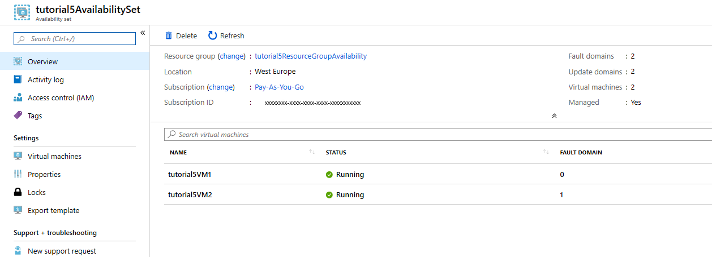

# Create and deploy highly available virtual machines with Azure PowerShell
We learn how to increase the availability and reliability of Virtual Machines (VMs) using Availability Sets. This ones make sure that the VMs we deploy on Azure are distributed accross multiple isolated hardware nodes, in a cluster.

__Use Availability Sets when you want to deploy reliable VM-based solutions in Azure__

### Create an availability set
The hardware in a location is divided in to multiple update domains and fault domains. An update domain is a group of VMs and underlying physical hardware that can be rebooted at the same time. VMs in the same fault domain share common storage as well as a common power source and network switch.
In order to creat an Availability Set, we use the follwing command *New-AzAvailabiltySet*
 
 * Let us first create Resource Group
```
New-AzResourceGroup `
   -Name tutorial5ResourceGroupAvailability `
   -Location WestEurope
```
```
ResourceGroupName : tutorial5ResourceGroupAvailability
Location          : westeurope
ProvisioningState : Succeeded
Tags              :
ResourceId        : /subscriptions/xxxxxxx-xxxx-xxxx-xxxx-xxxxxxxxxxx/resourceGroups/tutorial5ResourceGroupAvailability
```
*Create a managed availabilty set using *New-AzAvailabilitySet* with the **-sku aligned** parameter
```
New-AzAvailabilitySet `
   -Location "WestEurope" `
   -Name "tutorial5AvailabilitySet" `
   -ResourceGroupName "tutorial5ResourceGroupAvailability" `
   -Sku aligned `
   -PlatformFaultDomainCount 2 `
   -PlatformUpdateDomainCount 2
```
```
ResourceGroupName         : tutorial5ResourceGroupAvailability
Id                        : /subscriptions/xxxxxxxx-xxxx-xxxx-xxxx-xxxxxxxxxxx/resourceGroups/tutorial5ResourceGroupAvailability/pro
                            viders/Microsoft.Compute/availabilitySets/tutorial5AvailabilitySet
Name                      : tutorial5AvailabilitySet
Type                      : Microsoft.Compute/availabilitySets
Location                  : westeurope
Managed                   :
Sku                       : Aligned
Tags                      : {}
PlatformFaultDomainCount  : 2
PlatformUpdateDomainCount : 2
Statuses                  : []
VirtualMachinesReferences : []
ProximityPlacementGroup   :
```
### Create VMs inside an availability set
VMs must be created within the availabilty set to make sure they are correctly distributed across the hardware. You can not add an existing VM to an availability set after it is created.
Create a VM with *New-AzVM*, you use the *-AvailabilitySetName* parameter to specify the name of the availabilty set.
```
$cred = Get-Credential
```
```
cmdlet Get-Credential at command pipeline position 1
Supply values for the following parameters:
Credential
```
Now create two VMs with *New-AzVM* in the availability set.
```
for ($i=1; $i -le 2; $i++)
{
    New-AzVm `
        -ResourceGroupName "tutorial5ResourceGroupAvailability" `
        -Name "tutorial5VM$i" `
        -Location "westeurope" `
        -VirtualNetworkName "tutorial5Vnet" `
        -SubnetName "tutorial5Subnet" `
        -SecurityGroupName "tutorial5NetworkSecurityGroup" `
        -PublicIpAddressName "tutorial5PublicIpAddress$i" `
        -AvailabilitySetName "tutorial5AvailabilitySet" `
        -Credential $cred
}
```
```
ResourceGroupName        : tutorial5ResourceGroupAvailability
Id                       : /subscriptions/xxxxxxxx-xxxx-xxxx-xxxx-xxxxxxxxxxx/resourceGroups/tutorial5ResourceGroupAvailability/prov
iders/Microsoft.Compute/virtualMachines/tutorial5VM1
VmId                     : 006f500a-f34d-4685-b70a-a60f05513e54
Name                     : tutorial5VM1
Type                     : Microsoft.Compute/virtualMachines
Location                 : westeurope
Tags                     : {}
AvailabilitySetReference : {Id}
HardwareProfile          : {VmSize}
NetworkProfile           : {NetworkInterfaces}
OSProfile                : {ComputerName, AdminUsername, WindowsConfiguration, Secrets, AllowExtensionOperations}
ProvisioningState        : Succeeded
StorageProfile           : {ImageReference, OsDisk, DataDisks}
FullyQualifiedDomainName : tutorial5vm1-ef7b46.westeurope.cloudapp.azure.com
```
```
ResourceGroupName        : tutorial5ResourceGroupAvailability
Id                       : /subscriptions/xxxxxxxx-xxxx-xxxx-xxxx-xxxxxxxxxxx/resourceGroups/tutorial5ResourceGroupAvailability/prov
iders/Microsoft.Compute/virtualMachines/tutorial5VM2
VmId                     : 8e556370-4a06-4098-abe0-38919aaa6597
Name                     : tutorial5VM2
Type                     : Microsoft.Compute/virtualMachines
Location                 : westeurope
Tags                     : {}
AvailabilitySetReference : {Id}
HardwareProfile          : {VmSize}
NetworkProfile           : {NetworkInterfaces}
OSProfile                : {ComputerName, AdminUsername, WindowsConfiguration, Secrets, AllowExtensionOperations}
ProvisioningState        : Succeeded
StorageProfile           : {ImageReference, OsDisk, DataDisks}
FullyQualifiedDomainName : tutorial5vm2-2fefc8.westeurope.cloudapp.azure.com
```
If you look at the availability set in the portal by going to `Resource Groups > tutorial5ResourceGroupAvailability > tutorial5AvailabilitySet`, you should see how the VMs are distributed across the two fault and update domains.



### Check for available VM sizes
You can add more VMs to the availabilty set, but you need to know what VM sizes are available on the hardware. Use *Get-VMSize* to list all the availabe sizes on the hardware cluster for the availability set.
```
Get-AzVMSize `
   -ResourceGroupName "tutorial5ResourceGroupAvailability" `
   -AvailabilitySetName "tutorial5AvailabilitySet"
```