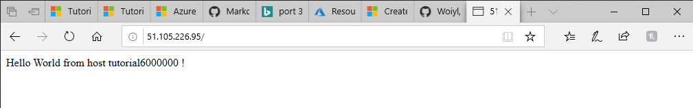

# Create a virtual machine scale set and deploy a highly available app on Windows with Azure PowerShell

A virtual machine scale set allows to deploy and manage a set of identical, autoscaling virtual machines. You can scale the number of VMs in the scale set manually.

### Scale set overview
A virtual machine scale set allows to deploy and manage a set of identical, autoscaling virtual machines.VMs in a scale set are distributed across logic fault and update domains in one or more placement groups. Placement groups are groups of similarly configured VMs , similar to __availability sets__.

### Create a scale set
Create a virtual machine scale set with __New-AzVmss__
```
New-AzVmss `
  -ResourceGroupName "tutorial6ResourceGroupScaleSet" `
  -Location "westeurope" `
  -VMScaleSetName "tutorial6ScaleSet" `
  -VirtualNetworkName "tutorial6Vnet" `
  -SubnetName "tutorial6Subnet" `
  -PublicIpAddressName "tutorial6PublicIPAddress" `
  -LoadBalancerName "tutorial6LoadBalancer" `
  -UpgradePolicyMode "Automatic"
```
```

cmdlet New-AzVmss at command pipeline position 1
Supply values for the following parameters:
Credential


ResourceGroupName                           : tutorial6ResourceGroupScaleSet
Sku                                         :
  Name                                      : Standard_DS1_v2
  Tier                                      : Standard
  Capacity                                  : 2
UpgradePolicy                               :
  Mode                                      : Automatic
VirtualMachineProfile                       :
  OsProfile                                 :
    ComputerNamePrefix                      : tutorial6
    AdminUsername                           : whammoumi
    WindowsConfiguration                    :
      ProvisionVMAgent                      : True
      EnableAutomaticUpdates                : True
  StorageProfile                            :
    ImageReference                          :
      Publisher                             : MicrosoftWindowsServer
      Offer                                 : WindowsServer
      Sku                                   : 2016-Datacenter
      Version                               : latest
    OsDisk                                  :
      Caching                               : None
      CreateOption                          : FromImage
      ManagedDisk                           :
        StorageAccountType                  : Premium_LRS
  NetworkProfile                            :
    NetworkInterfaceConfigurations[0]       :
      Name                                  : tutorial6ScaleSet
      Primary                               : True
      EnableAcceleratedNetworking           : False
      DnsSettings                           :
      IpConfigurations[0]                   :
        Name                                : tutorial6ScaleSet
        Subnet                              :
          Id                                : /subscriptions/xxxxxxxx-xxxx-xxxx-xxxxxxxxxxxxxxxxx/resourceGroups/tutorial6ResourceGro
upScaleSet/providers/Microsoft.Network/virtualNetworks/tutorial6Vnet/subnets/tutorial6Subnet
        PrivateIPAddressVersion             : IPv4
        LoadBalancerBackendAddressPools[0]  :
          Id                                : /subscriptions/xxxxxxxx-xxxx-xxxx-xxxxxxxxxxxxxxxxx/resourceGroups/tutorial6ResourceGro
upScaleSet/providers/Microsoft.Network/loadBalancers/tutorial6LoadBalancer/backendAddressPools/tutorial6ScaleSet
        LoadBalancerInboundNatPools[0]      :
          Id                                : /subscriptions/xxxxxxxx-xxxx-xxxx-xxxxxxxxxxxxxxxxx/resourceGroups/tutorial6ResourceGro
upScaleSet/providers/Microsoft.Network/loadBalancers/tutorial6LoadBalancer/inboundNatPools/tutorial6ScaleSet3389
        LoadBalancerInboundNatPools[1]      :
          Id                                : /subscriptions/xxxxxxxx-xxxx-xxxx-xxxxxxxxxxxxxxxxx/resourceGroups/tutorial6ResourceGro
upScaleSet/providers/Microsoft.Network/loadBalancers/tutorial6LoadBalancer/inboundNatPools/tutorial6ScaleSet5985
      EnableIPForwarding                    : False
ProvisioningState                           : Succeeded
Overprovision                               : True
DoNotRunExtensionsOnOverprovisionedVMs      : False
UniqueId                                    : 04bfe282-4025-4a21-8599-b3d5865ecec0
SinglePlacementGroup                        : False
Id                                          : /subscriptions/xxxxxxxx-xxxx-xxxx-xxxxxxxxxxxxxxxxx/resourceGroups/tutorial6ResourceGro
upScaleSet/providers/Microsoft.Compute/virtualMachineScaleSets/tutorial6ScaleSet
Name                                        : tutorial6ScaleSet
Type                                        : Microsoft.Compute/virtualMachineScaleSets
Location                                    : westeurope
Tags                                        : {}
FullyQualifiedDomainName                    : tutorial6scaleset-cd068e.westeurope.cloudapp.azure.com


```
### Deploy sample application
To test your scale set, install a basic web application. The Azure Custom Script Extension is used to download and run a script that installs IIS on the VM instances. This extension is useful for post deployment configuration, software installation, or any other configuration / management task.

Use the Custom Script Extension to install a basic IIS web server. Apply the Custom Script Extension that installs IIS as follows:
```
# Define the script for your Custom Script Extension to run
$publicSettings = @{
    "fileUris" = (,"https://raw.githubusercontent.com/Azure-Samples/compute-automation-configurations/master/automate-iis.ps1");
    "commandToExecute" = "powershell -ExecutionPolicy Unrestricted -File automate-iis.ps1"
}

# Get information about the scale set
$vmss = Get-AzVmss `
  -ResourceGroupName "tutorial6ResourceGroupScaleSet" `
  -VMScaleSetName "tutorial6ScaleSet"

# Use Custom Script Extension to install IIS and configure basic website
Add-AzVmssExtension -VirtualMachineScaleSet $vmss `
  -Name "customScript" `
  -Publisher "Microsoft.Compute" `
  -Type "CustomScriptExtension" `
  -TypeHandlerVersion 1.8 `
  -Setting $publicSettings

# Update the scale set and apply the Custom Script Extension to the VM instances
Update-AzVmss `
  -ResourceGroupName "tutorial6ResourceGroupScaleSet" `
  -Name "tutorial6ScaleSet" `
  -VirtualMachineScaleSet $vmss
```
```
ResourceGroupName                           : tutorial6ResourceGroupScaleSet
Sku                                         :
  Name                                      : Standard_DS1_v2
  Tier                                      : Standard
  Capacity                                  : 2
UpgradePolicy                               :
  Mode                                      : Automatic
VirtualMachineProfile                       :
  OsProfile                                 :
    ComputerNamePrefix                      : tutorial6
    AdminUsername                           : whammoumi
    WindowsConfiguration                    :
      ProvisionVMAgent                      : True
      EnableAutomaticUpdates                : True
  StorageProfile                            :
    ImageReference                          :
      Publisher                             : MicrosoftWindowsServer
      Offer                                 : WindowsServer
      Sku                                   : 2016-Datacenter
      Version                               : latest
    OsDisk                                  :
      Caching                               : None
      CreateOption                          : FromImage
      ManagedDisk                           :
        StorageAccountType                  : Premium_LRS
  NetworkProfile                            :
    NetworkInterfaceConfigurations[0]       :
      Name                                  : tutorial6ScaleSet
      Primary                               : True
      EnableAcceleratedNetworking           : False
      DnsSettings                           :
      IpConfigurations[0]                   :
        Name                                : tutorial6ScaleSet
        Subnet                              :
          Id                                : /subscriptions/xxxxxxxx-xxxx-xxxx-xxxxxxxxxxxxxxxxx/resourceGroups/tutorial6ResourceGr
oupScaleSet/providers/Microsoft.Network/virtualNetworks/tutorial6Vnet/subnets/tutorial6Subnet
        PrivateIPAddressVersion             : IPv4
        LoadBalancerBackendAddressPools[0]  :
          Id                                : /subscriptions/xxxxxxxx-xxxx-xxxx-xxxxxxxxxxxxxxxxx/resourceGroups/tutorial6ResourceGr
oupScaleSet/providers/Microsoft.Network/loadBalancers/tutorial6LoadBalancer/backendAddressPools/tutorial6ScaleSet
        LoadBalancerInboundNatPools[0]      :
          Id                                : /subscriptions/xxxxxxxx-xxxx-xxxx-xxxxxxxxxxxxxxxxx/resourceGroups/tutorial6ResourceGr
oupScaleSet/providers/Microsoft.Network/loadBalancers/tutorial6LoadBalancer/inboundNatPools/tutorial6ScaleSet3389
        LoadBalancerInboundNatPools[1]      :
          Id                                : /subscriptions/xxxxxxxx-xxxx-xxxx-xxxxxxxxxxxxxxxxx/resourceGroups/tutorial6ResourceGr
oupScaleSet/providers/Microsoft.Network/loadBalancers/tutorial6LoadBalancer/inboundNatPools/tutorial6ScaleSet5985
      EnableIPForwarding                    : False
  ExtensionProfile                          :
    Extensions[0]                           :
      Name                                  : customScript
      Publisher                             : Microsoft.Compute
      Type                                  : CustomScriptExtension
      TypeHandlerVersion                    : 1.8
      Settings                              : System.Collections.Hashtable
ProvisioningState                           : Succeeded
Overprovision                               : True
DoNotRunExtensionsOnOverprovisionedVMs      : False
UniqueId                                    : 04bfe282-4025-4a21-8599-b3d5865ecec0
SinglePlacementGroup                        : False
Id                                          : /subscriptions/xxxxxxxx-xxxx-xxxx-xxxxxxxxxxxxxxxxx/resourceGroups/tutorial6ResourceGr
oupScaleSet/providers/Microsoft.Compute/virtualMachineScaleSets/tutorial6ScaleSet
Name                                        : tutorial6ScaleSet
Type                                        : Microsoft.Compute/virtualMachineScaleSets
Location                                    : westeurope
Tags                                        : {}
```
### Allow traffic to application
To allow access to the basic web application, create a network security group with __New-AzNetworkSecurityRuleConfig__ and __New-AzNetworkSecurityGroup__.

```
# Get information about the scale set
$vmss = Get-AzVmss `
  -ResourceGroupName "tutorial6ResourceGroupScaleSet" `
  -VMScaleSetName "tutorial6ScaleSet"

#Create a rule to allow traffic over port 80
$nsgFrontendRule = New-AzNetworkSecurityRuleConfig `
  -Name tutorial6FrontendNSGRule `
  -Protocol Tcp `
  -Direction Inbound `
  -Priority 200 `
  -SourceAddressPrefix * `
  -SourcePortRange * `
  -DestinationAddressPrefix * `
  -DestinationPortRange 80 `
  -Access Allow

#Create a network security group and associate it with the rule
$nsgFrontend = New-AzNetworkSecurityGroup `
  -ResourceGroupName  "tutorial6ResourceGroupScaleSet" `
  -Location westeurope `
  -Name tutorial6FrontendNSG `
  -SecurityRules $nsgFrontendRule

$vnet = Get-AzVirtualNetwork `
  -ResourceGroupName  "tutorial6ResourceGroupScaleSet" `
  -Name tutorial6Vnet

$frontendSubnet = $vnet.Subnets[0]

$frontendSubnetConfig = Set-AzVirtualNetworkSubnetConfig `
  -VirtualNetwork $vnet `
  -Name tutorial6Subnet `
  -AddressPrefix $frontendSubnet.AddressPrefix `
  -NetworkSecurityGroup $nsgFrontend

Set-AzVirtualNetwork -VirtualNetwork $vnet

# Update the scale set and apply the Custom Script Extension to the VM instances
Update-AzVmss `
  -ResourceGroupName "tutorial6ResourceGroupScaleSet" `
  -Name "tutorial6ScaleSet" `
  -VirtualMachineScaleSet $vmss
```
```

Name                   : tutorial6Vnet
ResourceGroupName      : tutorial6ResourceGroupScaleSet
Location               : westeurope
Id                     : /subscriptions/xxxxxxxx-xxxx-xxxx-xxxxxxxxxxxxxxxxx/resourceGroups/tutorial6ResourceGroupScaleSet/pro
                         viders/Microsoft.Network/virtualNetworks/tutorial6Vnet
Etag                   : W/"58ae5225-e6cf-46c7-8242-919d9a6ac876"
ResourceGuid           : 54c14cba-5996-4ac0-8837-4ba3020a3101
ProvisioningState      : Succeeded
Tags                   :
AddressSpace           : {
                           "AddressPrefixes": [
                             "192.168.0.0/16"
                           ]
                         }
DhcpOptions            : {
                           "DnsServers": []
                         }
Subnets                : [
                           {
                             "Delegations": [],
                             "Name": "tutorial6Subnet",
                             "Etag": "W/\"58ae5225-e6cf-46c7-8242-919d9a6ac876\"",
                             "Id": "/subscriptions/xxxxxxxx-xxxx-xxxx-xxxxxxxxxxxxxxxxx/resourceGroups/tutorial6ResourceGroupS
                         caleSet/providers/Microsoft.Network/virtualNetworks/tutorial6Vnet/subnets/tutorial6Subnet",
                             "AddressPrefix": [
                               "192.168.1.0/24"
                             ],
                             "IpConfigurations": [
                               {
                                 "Id": "/subscriptions/xxxxxxxx-xxxx-xxxx-xxxxxxxxxxxxxxxxx/resourceGroups/tutorial6ResourceGr
                         oupScaleSet/providers/Microsoft.Compute/virtualMachineScaleSets/tutorial6ScaleSet/virtualMachines/0/n
                         etworkInterfaces/tutorial6ScaleSet/ipConfigurations/tutorial6ScaleSet"
                               },
                               {
                                 "Id": "/subscriptions/xxxxxxxx-xxxx-xxxx-xxxxxxxxxxxxxxxxx/resourceGroups/tutorial6ResourceGr
                         oupScaleSet/providers/Microsoft.Compute/virtualMachineScaleSets/tutorial6ScaleSet/virtualMachines/1/n
                         etworkInterfaces/tutorial6ScaleSet/ipConfigurations/tutorial6ScaleSet"
                               }
                             ],
                             "ServiceAssociationLinks": [],
                             "ResourceNavigationLinks": [],
                             "NetworkSecurityGroup": {
                               "Id": "/subscriptions/xxxxxxxx-xxxx-xxxx-xxxxxxxxxxxxxxxxx/resourceGroups/tutorial6ResourceGrou
                         pScaleSet/providers/Microsoft.Network/networkSecurityGroups/tutorial6FrontendNSG"
                             },
                             "ServiceEndpoints": [],
                             "ServiceEndpointPolicies": [],
                             "PrivateEndpoints": [],
                             "ProvisioningState": "Succeeded"
                           }
                         ]
VirtualNetworkPeerings : []
EnableDdosProtection   : false
DdosProtectionPlan     : null
```
### Test your scale set
To see your scale set in action, get the public IP address of your load balancer with __Get-AzPublicIPAddress__.
```
Get-AzPublicIPAddress `
  -ResourceGroupName "tutorial6ResourceGroupScaleSet" `
  -Name "tutorial6PublicIPAddress" | select IpAddress
```
```
IpAddress
---------
51.105.226.95
```
The web app is displayed, including the hostname of the VM that the load balancer distributed traffic to:



To see the scale set in action, you can force-refresh your web browser to see the load balancer distribute traffic across all the VMs running your app.

### Management tasks
#### View VM in a scale set
```
Get-AzVmssVM `
  -ResourceGroupName "tutorial6ResourceGroupScaleSet" `
  -VMScaleSetName "tutorial6ScaleSet"
```
```
ResourceGroupName                             Name   Location             Sku Capacity InstanceID ProvisioningState
-----------------                             ----   --------             --- -------- ---------- -----------------
tutorial6ResourceGroupScaleSet tutorial6ScaleSet_0 westeurope Standard_DS1_v2                   0         Succeeded
tutorial6ResourceGroupScaleSet tutorial6ScaleSet_1 westeurope Standard_DS1_v2                   1         Succeeded
```
To view additional information about a specific vm instance, add the `InstanceId` parameter to __GetAzVmmssVM__

```
Get-AzVmssVM `
  -ResourceGroupName "tutorial6ResourceGroupScaleSet" `
  -VMScaleSetName "tutorial6ScaleSet" `
  -InstanceId "1"
```
```
ResourceGroupName                         : tutorial6ResourceGroupScaleSet
InstanceId                                : 1
Sku                                       :
  Name                                    : Standard_DS1_v2
  Tier                                    : Standard
LatestModelApplied                        : True
VmId                                      : 4277d7b3-8f79-4e99-aa4b-bb6309c40598
HardwareProfile                           :
StorageProfile                            :
  ImageReference                          :
    Publisher                             : MicrosoftWindowsServer
    Offer                                 : WindowsServer
    Sku                                   : 2016-Datacenter
    Version                               : 14393.3085.1907121547
  OsDisk                                  :
    OsType                                : Windows
    Name                                  : tutorial6ScaleSet_tutorial6ScaleSet_1_OsDisk_1_c6e7f5a6246e459896757f2d22d670d2
    Caching                               : None
    CreateOption                          : FromImage
    DiskSizeGB                            : 127
    ManagedDisk                           :
      Id                                  : /subscriptions/xxxxxxxx-xxxx-xxxx-xxxxxxxxxxxxxxxxx/resourceGroups/tutorial6Resour
ceGroupScaleSet/providers/Microsoft.Compute/disks/tutorial6ScaleSet_tutorial6ScaleSet_1_OsDisk_1_c6e7f5a6246e459896757f2d22d67
0d2
      StorageAccountType                  : Premium_LRS
OsProfile                                 :
  ComputerName                            : tutorial6000001
  AdminUsername                           : whammoumi
  WindowsConfiguration                    :
    ProvisionVMAgent                      : True
    EnableAutomaticUpdates                : True
  AllowExtensionOperations                : True
NetworkProfile                            :
  NetworkInterfaces[0]                    :
    Id                                    : /subscriptions/xxxxxxxx-xxxx-xxxx-xxxxxxxxxxxxxxxxx/resourceGroups/tutorial6Resour
ceGroupScaleSet/providers/Microsoft.Compute/virtualMachineScaleSets/tutorial6ScaleSet/virtualMachines/1/networkInterfaces/tuto
rial6ScaleSet
NetworkProfileConfiguration               :
  NetworkInterfaceConfigurations[0]       :
    Name                                  : tutorial6ScaleSet
    Primary                               : True
    EnableAcceleratedNetworking           : False
    DnsSettings                           :
    IpConfigurations[0]                   :
      Name                                : tutorial6ScaleSet
      Subnet                              :
        Id                                : /subscriptions/xxxxxxxx-xxxx-xxxx-xxxxxxxxxxxxxxxxx/resourceGroups/tutorial6Resour
ceGroupScaleSet/providers/Microsoft.Network/virtualNetworks/tutorial6Vnet/subnets/tutorial6Subnet
      PrivateIPAddressVersion             : IPv4
      LoadBalancerBackendAddressPools[0]  :
        Id                                : /subscriptions/xxxxxxxx-xxxx-xxxx-xxxxxxxxxxxxxxxxx/resourceGroups/tutorial6Resour
ceGroupScaleSet/providers/Microsoft.Network/loadBalancers/tutorial6LoadBalancer/backendAddressPools/tutorial6ScaleSet
      LoadBalancerInboundNatPools[0]      :
        Id                                : /subscriptions/xxxxxxxx-xxxx-xxxx-xxxxxxxxxxxxxxxxx/resourceGroups/tutorial6Resour
ceGroupScaleSet/providers/Microsoft.Network/loadBalancers/tutorial6LoadBalancer/inboundNatPools/tutorial6ScaleSet3389
      LoadBalancerInboundNatPools[1]      :
        Id                                : /subscriptions/xxxxxxxx-xxxx-xxxx-xxxxxxxxxxxxxxxxx/resourceGroups/tutorial6Resour
ceGroupScaleSet/providers/Microsoft.Network/loadBalancers/tutorial6LoadBalancer/inboundNatPools/tutorial6ScaleSet5985
    EnableIPForwarding                    : False
ProvisioningState                         : Succeeded
ModelDefinitionApplied                    : VirtualMachineScaleSet
Resources[0]                              :
  Id                                      : /subscriptions/xxxxxxxx-xxxx-xxxx-xxxxxxxxxxxxxxxxx/resourceGroups/tutorial6Resour
ceGroupScaleSet/providers/Microsoft.Compute/virtualMachines/tutorial6ScaleSet_1/extensions/customScript
  Name                                    : customScript
  Type                                    : Microsoft.Compute/virtualMachines/extensions
  Location                                : westeurope
  Publisher                               : Microsoft.Compute
  VirtualMachineExtensionType             : CustomScriptExtension
  TypeHandlerVersion                      : 1.8
  AutoUpgradeMinorVersion                 : False
  Settings                                : {"fileUris":["https://raw.githubusercontent.com/Azure-Samples/compute-automation-c
onfigurations/master/automate-iis.ps1"],"commandToExecute":"powershell -ExecutionPolicy Unrestricted -File automate-iis.ps1"}
  ProvisioningState                       : Succeeded
Id                                        : /subscriptions/xxxxxxxx-xxxx-xxxx-xxxxxxxxxxxxxxxxx/resourceGroups/tutorial6Resour
ceGroupScaleSet/providers/Microsoft.Compute/virtualMachineScaleSets/tutorial6ScaleSet/virtualMachines/1
Name                                      : tutorial6ScaleSet_1
Type                                      : Microsoft.Compute/virtualMachineScaleSets/virtualMachines
Location                                  : westeurope
Tags                                      : {}
```
### Increase or decrease VM instances
To see the number of instances you currently have in scale set, use __Get-AzVmss__ and query on *sku.capacity*
```
Get-AzVmss -ResourceGroupName "tutorial6ResourceGroupScaleSet" `
  -VMScaleSetName "tutorial6ScaleSet" | `
  Select -ExpandProperty Sku
```
```

Name            Tier     Capacity
----            ----     --------
Standard_DS1_v2 Standard        2
```
The following example set the number of VMs to 3:
```
# Get current scale set
$scaleset = Get-AzVmss `
  -ResourceGroupName "tutorial6ResourceGroupScaleSet" `
  -VMScaleSetName "tutorial6ScaleSet"

# Set and update the capacity of your scale set
$scaleset.sku.capacity = 3
Update-AzVmss -ResourceGroupName "tutorial6ResourceGroupScaleSet" `
    -Name "tutorial6ScaleSet" `
    -VirtualMachineScaleSet $scaleset
```
```
ResourceGroupName                           : tutorial6ResourceGroupScaleSet
Sku                                         :
  Name                                      : Standard_DS1_v2
  Tier                                      : Standard
  Capacity                                  : 3
UpgradePolicy                               :
  Mode                                      : Automatic
VirtualMachineProfile                       :
  OsProfile                                 :
    ComputerNamePrefix                      : tutorial6
    AdminUsername                           : whammoumi
    WindowsConfiguration                    :
      ProvisionVMAgent                      : True
      EnableAutomaticUpdates                : True
  StorageProfile                            :
    ImageReference                          :
      Publisher                             : MicrosoftWindowsServer
      Offer                                 : WindowsServer
      Sku                                   : 2016-Datacenter
      Version                               : latest
    OsDisk                                  :
      Caching                               : None
      CreateOption                          : FromImage
      ManagedDisk                           :
        StorageAccountType                  : Premium_LRS
  NetworkProfile                            :
    NetworkInterfaceConfigurations[0]       :
      Name                                  : tutorial6ScaleSet
      Primary                               : True
      EnableAcceleratedNetworking           : False
      DnsSettings                           :
      IpConfigurations[0]                   :
        Name                                : tutorial6ScaleSet
        Subnet                              :
          Id                                : /subscriptions/xxxxxxxx-xxxx-xxxx-xxxxxxxxxxxxxxxxx/resourceGroups/tutorial6Reso
urceGroupScaleSet/providers/Microsoft.Network/virtualNetworks/tutorial6Vnet/subnets/tutorial6Subnet
        PrivateIPAddressVersion             : IPv4
        LoadBalancerBackendAddressPools[0]  :
          Id                                : /subscriptions/xxxxxxxx-xxxx-xxxx-xxxxxxxxxxxxxxxxx/resourceGroups/tutorial6Reso
urceGroupScaleSet/providers/Microsoft.Network/loadBalancers/tutorial6LoadBalancer/backendAddressPools/tutorial6ScaleSet
        LoadBalancerInboundNatPools[0]      :
          Id                                : /subscriptions/xxxxxxxx-xxxx-xxxx-xxxxxxxxxxxxxxxxx/resourceGroups/tutorial6Reso
urceGroupScaleSet/providers/Microsoft.Network/loadBalancers/tutorial6LoadBalancer/inboundNatPools/tutorial6ScaleSet3389
        LoadBalancerInboundNatPools[1]      :
          Id                                : /subscriptions/xxxxxxxx-xxxx-xxxx-xxxxxxxxxxxxxxxxx/resourceGroups/tutorial6Reso
urceGroupScaleSet/providers/Microsoft.Network/loadBalancers/tutorial6LoadBalancer/inboundNatPools/tutorial6ScaleSet5985
      EnableIPForwarding                    : False
  ExtensionProfile                          :
    Extensions[0]                           :
      Name                                  : customScript
      Publisher                             : Microsoft.Compute
      Type                                  : CustomScriptExtension
      TypeHandlerVersion                    : 1.8
      AutoUpgradeMinorVersion               : False
      Settings                              : {"fileUris":["https://raw.githubusercontent.com/Azure-Samples/compute-automation
-configurations/master/automate-iis.ps1"],"commandToExecute":"powershell -ExecutionPolicy Unrestricted -File
automate-iis.ps1"}
ProvisioningState                           : Succeeded
Overprovision                               : True
DoNotRunExtensionsOnOverprovisionedVMs      : False
UniqueId                                    : 04bfe282-4025-4a21-8599-b3d5865ecec0
SinglePlacementGroup                        : False
Id                                          : /subscriptions/xxxxxxxx-xxxx-xxxx-xxxxxxxxxxxxxxxxx/resourceGroups/tutorial6Reso
urceGroupScaleSet/providers/Microsoft.Compute/virtualMachineScaleSets/tutorial6ScaleSet
Name                                        : tutorial6ScaleSet
Type                                        : Microsoft.Compute/virtualMachineScaleSets
Location                                    : westeurope
Tags                                        : {}
```
### Configure auto scale rules
The following example scales out the number of instances by one when the average CPU load is greater than 60% over a 5-minute period. If the average CPU load then drops below 30% over a 5-minute period, the instances are scaled in by one instance:
```
# Define your scale set information
$mySubscriptionId = (Get-AzSubscription)[0].Id
$myResourceGroup = "tutorial6ResourceGroupScaleSet"
$myScaleSet = "tutorial6ScaleSet"
$myLocation = "West Europe"
$myScaleSetId = (Get-AzVmss -ResourceGroupName $myResourceGroup -VMScaleSetName $myScaleSet).Id 

# Create a scale up rule to increase the number instances after 60% average CPU usage exceeded for a 5-minute period
$myRuleScaleUp = New-AzAutoscaleRule `
  -MetricName "Percentage CPU" `
  -MetricResourceId $myScaleSetId `
  -Operator GreaterThan `
  -MetricStatistic Average `
  -Threshold 60 `
  -TimeGrain 00:01:00 `
  -TimeWindow 00:05:00 `
  -ScaleActionCooldown 00:05:00 `
  -ScaleActionDirection Increase `
  -ScaleActionValue 1

# Create a scale down rule to decrease the number of instances after 30% average CPU usage over a 5-minute period
$myRuleScaleDown = New-AzAutoscaleRule `
  -MetricName "Percentage CPU" `
  -MetricResourceId $myScaleSetId `
  -Operator LessThan `
  -MetricStatistic Average `
  -Threshold 30 `
  -TimeGrain 00:01:00 `
  -TimeWindow 00:05:00 `
  -ScaleActionCooldown 00:05:00 `
  -ScaleActionDirection Decrease `
  -ScaleActionValue 1

# Create a scale profile with your scale up and scale down rules
$myScaleProfile = New-AzAutoscaleProfile `
  -DefaultCapacity 2  `
  -MaximumCapacity 10 `
  -MinimumCapacity 2 `
  -Rule $myRuleScaleUp,$myRuleScaleDown `
  -Name "autoprofile"

# Apply the autoscale rules
Add-AzAutoscaleSetting `
  -Location $myLocation `
  -Name "autosetting" `
  -ResourceGroup $myResourceGroup `
  -TargetResourceId $myScaleSetId `
  -AutoscaleProfile $myScaleProfile
```
### Configure autoscale rules
Rather than manually scaling the number of instances in your scale set, you define autoscale rules. These rules monitor the instances in your scale set and respond accordingly based on metrics and thresholds you define.

The following example scales out the number of instances by one when the average CPU load is greater than 60% over a 5-minute period. If the average CPU load then drops below 30% over a 5-minute period, the instances are scaled in by one instance:

```
# Define your scale set information
$mySubscriptionId = (Get-AzSubscription)[0].Id
$myResourceGroup = "tutorial6ResourceGroupScaleSet"
$myScaleSet = "tutorial6ScaleSet"
$myLocation = "West Europe"
$myScaleSetId = (Get-AzVmss -ResourceGroupName $myResourceGroup -VMScaleSetName $myScaleSet).Id 

# Create a scale up rule to increase the number instances after 60% average CPU usage exceeded for a 5-minute period
$myRuleScaleUp = New-AzAutoscaleRule `
  -MetricName "Percentage CPU" `
  -MetricResourceId $myScaleSetId `
  -Operator GreaterThan `
  -MetricStatistic Average `
  -Threshold 60 `
  -TimeGrain 00:01:00 `
  -TimeWindow 00:05:00 `
  -ScaleActionCooldown 00:05:00 `
  -ScaleActionDirection Increase `
  -ScaleActionValue 1

# Create a scale down rule to decrease the number of instances after 30% average CPU usage over a 5-minute period
$myRuleScaleDown = New-AzAutoscaleRule `
  -MetricName "Percentage CPU" `
  -MetricResourceId $myScaleSetId `
  -Operator LessThan `
  -MetricStatistic Average `
  -Threshold 30 `
  -TimeGrain 00:01:00 `
  -TimeWindow 00:05:00 `
  -ScaleActionCooldown 00:05:00 `
  -ScaleActionDirection Decrease `
  -ScaleActionValue 1

# Create a scale profile with your scale up and scale down rules
$myScaleProfile = New-AzAutoscaleProfile `
  -DefaultCapacity 2  `
  -MaximumCapacity 10 `
  -MinimumCapacity 2 `
  -Rule $myRuleScaleUp,$myRuleScaleDown `
  -Name "autoprofile"

# Apply the autoscale rules
Add-AzAutoscaleSetting `
  -Location $myLocation `
  -Name "autosetting" `
  -ResourceGroup $myResourceGroup `
  -TargetResourceId $myScaleSetId `
  -AutoscaleProfile $myScaleProfile
```
```
SettingSpec                                                                   RequestId                            StatusCode
-----------                                                                   ---------                            ----------
Microsoft.Azure.Management.Monitor.Management.Models.AutoscaleSettingResource 0d6ac3e5-dabf-40ff-aebb-5d894cc74814    Created


```
### Delete resource group
```
Remove-AzResourceGroup `
   -Name "tutorial6ResourceGroupScaleSet" `
   -Force
```
```
True
```