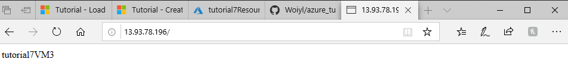

# Create a highly available application with Azure PowerShell

Load balancing provides a higher level of availability by spreading incoming requets across multiple virtual machines. Learn about different components of the Azure load balancer that distributes traffic and provide high availaibilty.

### Azure load balancer overview

An Azure load balancer is a Layer-4 (TCP, UDP) load balancer that provides high availability by distributing incoming traffic among healthy VMs. A load balancer health probe monitors a given port on each VM and only distributes traffic to an operational VM.
You define a front-end IP configuration that contains one or more public IP addresses. This front-end IP configuration allows your load balancer and applications to be accessible over the Internet.
Virtual machines connect to a load balancer using their virtual network interface card (NIC). To distribute traffic to the VMs, a back-end address pool contains the IP addresses of the virtual (NICs) connected to the load balancer.
To control the flow of traffic, you define load balancer rules for specific ports and protocols that map to your VMs.

### Create Azure load balancer
Before you can create your load balancer, create a resource group with New-AzResourceGroup.
```
New-AzResourceGroup -ResourceGroupName "tutorial7ResourceGroupLoadBalancer" -Location "WestEurope"
```

### Create a public IP Address

To access your app on the internet, you need a public IP address for the load balancer. Create a public IP address with __New-AzPublicIPAddress__ 
```
$publicIP = New-AzPublicIpAddress -ResourceGroupName "tutorial7ResourceGroupLoadBalancer" -Location "WestEurope" -AllocationMethod "Static" -Name "tutorial7PublicIP"
```
### Create a load balancer
Create a frontend IP pool with __New-AzLoadBalancerFrontendIpConfig__.
```
$frontendIP = New-AzLoadBalancerFrontendIpConfig -Name "tutorial7FrontEndPool" -PublicIpAddress $publicIP
```
Create a backend address pool with __New-AzLoadBalancerBackendAddressPoolConfig__. The VMs attach to this backend pool in the remaining steps.
```
$backendPool = New-AzLoadBalancerBackendAddressPoolConfig -Name "tutorial7BackEndPool"
```
Now create the load balancer with __New-AzLoadBalancer__
```
$lb = New-AzLoadBalancer -ResourceGroupName "tutorial7ResourceGroupLoadBalancer" -Name "tutorial7LoadBalancer" -Location "WestEurope" -FrontendIpConfiguration $frontendIP -BackendAddressPool $backendPool
```
### Create a health probe
To allow the loadbalancer to monitor the status of your app, you use a health probe. The health probe dynamically adds or removes VMs from the load balancer rotation based on their response to health check. By default, a VM is removed from the load balancer distribution after two consecutive failures at 15 second intervals. You create a health probe based on a protocol or a specific health check page for your app.

You can also create custom HTTP probes for more fine grained health checks. When using a custom HTTP probe, you must create the health check page, such as healthcheck.aspx. The probe must return an __HTTP 200 OK__ response for the load balancer to keep the host in rotation.
To create a TCP health probe, you use __Add-AzLoadBalancerProbeConfig__
```
Add-AzLoadBalancerProbeConfig -Name "tutorial7HealthProbe" -LoadBalancer $lb -Protocol tcp -Port 80 -IntervalInSeconds 15  -ProbeCount 2
```
```
Name                     : tutorial7LoadBalancer
ResourceGroupName        : tutorial7ResourceGroupLoadBalancer
Location                 : westeurope
Id                       : /subscriptions/xxx-x-xxx-xxxxx/resourceGroups/tutorial7ResourceGroupLoadBalancer/prov
                           iders/Microsoft.Network/loadBalancers/tutorial7LoadBalancer
Etag                     : W/"7a88e89c-3bdb-40c8-967a-ab0ad667b526"
ResourceGuid             : d3bff2e5-3f88-4b63-814b-0f36a96b4c3c
ProvisioningState        : Succeeded
Tags                     :
FrontendIpConfigurations : [
                             {
                               "Name": "tutorial7FrontEndPool",
                               "Etag": "W/\"7a88e89c-3bdb-40c8-967a-ab0ad667b526\"",
                               "Id": "/subscriptions/xxx-x-xxx-xxxxx/resourceGroups/tutorial7ResourceGroupLoadBa
                           lancer/providers/Microsoft.Network/loadBalancers/tutorial7LoadBalancer/frontendIPConfigurations/tutorial7F
                           rontEndPool",
                               "PrivateIpAllocationMethod": "Dynamic",
                               "ProvisioningState": "Succeeded",
                               "Zones": [],
                               "InboundNatRules": [],
                               "InboundNatPools": [],
                               "OutboundRules": [],
                               "LoadBalancingRules": [],
                               "PublicIpAddress": {
                                 "IpTags": [],
                                 "Zones": [],
                                 "Id": "/subscriptions/xxx-x-xxx-xxxxx/resourceGroups/tutorial7ResourceGroupLoad
                           Balancer/providers/Microsoft.Network/publicIPAddresses/tutorial7PublicIP"
                               }
                             }
                           ]
BackendAddressPools      : [
                             {
                               "Name": "tutorial7BackEndPool",
                               "Etag": "W/\"7a88e89c-3bdb-40c8-967a-ab0ad667b526\"",
                               "Id": "/subscriptions/xxx-x-xxx-xxxxx/resourceGroups/tutorial7ResourceGroupLoadBa
                           lancer/providers/Microsoft.Network/loadBalancers/tutorial7LoadBalancer/backendAddressPools/tutorial7BackEn
                           dPool",
                               "ProvisioningState": "Succeeded",
                               "BackendIpConfigurations": [],
                               "LoadBalancingRules": []
                             }
                           ]
LoadBalancingRules       : []
Probes                   : [
                             {
                               "Name": "tutorial7HealthProbe",
                               "Id": "/subscriptions/xxx-x-xxx-xxxxx/resourceGroups/tutorial7ResourceGroupLoadBa
                           lancer/providers/Microsoft.Network/loadBalancers/tutorial7LoadBalancer/Probes/tutorial7HealthProbe",
                               "Protocol": "tcp",
                               "Port": 80,
                               "IntervalInSeconds": 15,
                               "NumberOfProbes": 2
                             }
                           ]
InboundNatRules          : []
InboundNatPools          : []
Sku                      : {
                             "Name": "Basic"
                           }
```
To apply the health probe, update the load balancer with __Set-AzLoadBalancer__
```
Set-AzLoadBalancer -LoadBalancer $lb
```
### Create a load balancer rule
A load balancer rule is used to define how traffic is distributed to the VMs. You define the front-end IP configuration for the incoming traffic and the back-end IP pool to receive the traffic, along with the required source and destination port. To make sure only healthy VMs receive traffic, you also define the health probe to use.

Create a load balancer rule with __Add-AzLoadBalancerRuleConfig__. The following creates a load balancer rule named *tutorial7LoadBalancerRule* and balances traffic on *TCP* port *80*
```
$probe = Get-AzLoadBalancerProbeConfig -LoadBalancer $lb -Name "tutorial7HealthProbe"

Add-AzLoadBalancerRuleConfig -Name "tutorial7LoadBalancerRule" -LoadBalancer $lb -FrontendIpConfiguration $lb.FrontendIpConfigurations[0] -BackendAddressPool $lb.BackendAddressPools[0] -Protocol Tcp -FrontendPort 80 -BackendPort 80 -Probe $probe
``` 
```
Name                     : tutorial7LoadBalancer
ResourceGroupName        : tutorial7ResourceGroupLoadBalancer
Location                 : westeurope
Id                       : /subscriptions/xxx-x-xxx-xxxxx/resourceGroups/tutorial7ResourceGroupLoadBalancer/prov
                           iders/Microsoft.Network/loadBalancers/tutorial7LoadBalancer
Etag                     : W/"7a88e89c-3bdb-40c8-967a-ab0ad667b526"
ResourceGuid             : d3bff2e5-3f88-4b63-814b-0f36a96b4c3c
ProvisioningState        : Succeeded
Tags                     :
FrontendIpConfigurations : [
                             {
                               "Name": "tutorial7FrontEndPool",
                               "Etag": "W/\"7a88e89c-3bdb-40c8-967a-ab0ad667b526\"",
                               "Id": "/subscriptions/xxx-x-xxx-xxxxx/resourceGroups/tutorial7ResourceGroupLoadBa
                           lancer/providers/Microsoft.Network/loadBalancers/tutorial7LoadBalancer/frontendIPConfigurations/tutorial7F
                           rontEndPool",
                               "PrivateIpAllocationMethod": "Dynamic",
                               "ProvisioningState": "Succeeded",
                               "Zones": [],
                               "InboundNatRules": [],
                               "InboundNatPools": [],
                               "OutboundRules": [],
                               "LoadBalancingRules": [],
                               "PublicIpAddress": {
                                 "IpTags": [],
                                 "Zones": [],
                                 "Id": "/subscriptions/xxx-x-xxx-xxxxx/resourceGroups/tutorial7ResourceGroupLoad
                           Balancer/providers/Microsoft.Network/publicIPAddresses/tutorial7PublicIP"
                               }
                             }
                           ]
BackendAddressPools      : [
                             {
                               "Name": "tutorial7BackEndPool",
                               "Etag": "W/\"7a88e89c-3bdb-40c8-967a-ab0ad667b526\"",
                               "Id": "/subscriptions/xxx-x-xxx-xxxxx/resourceGroups/tutorial7ResourceGroupLoadBa
                           lancer/providers/Microsoft.Network/loadBalancers/tutorial7LoadBalancer/backendAddressPools/tutorial7BackEn
                           dPool",
                               "ProvisioningState": "Succeeded",
                               "BackendIpConfigurations": [],
                               "LoadBalancingRules": []
                             }
                           ]
LoadBalancingRules       : [
                             {
                               "Name": "tutorial7LoadBalancerRule",
                               "Id": "/subscriptions/xxx-x-xxx-xxxxx/resourceGroups/tutorial7ResourceGroupLoadBa
                           lancer/providers/Microsoft.Network/loadBalancers/tutorial7LoadBalancer/LoadBalancingRules/tutorial7LoadBal
                           ancerRule",
                               "Protocol": "Tcp",
                               "FrontendPort": 80,
                               "BackendPort": 80,
                               "IdleTimeoutInMinutes": 4,
                               "EnableFloatingIP": false,
                               "EnableTcpReset": false,
                               "DisableOutboundSNAT": false,
                               "FrontendIPConfiguration": {
                                 "Id": "/subscriptions/xxx-x-xxx-xxxxx/resourceGroups/tutorial7ResourceGroupLoad
                           Balancer/providers/Microsoft.Network/loadBalancers/tutorial7LoadBalancer/frontendIPConfigurations/tutorial
                           7FrontEndPool"
                               },
                               "BackendAddressPool": {
                                 "Id": "/subscriptions/xxx-x-xxx-xxxxx/resourceGroups/tutorial7ResourceGroupLoad
                           Balancer/providers/Microsoft.Network/loadBalancers/tutorial7LoadBalancer/backendAddressPools/tutorial7Back
                           EndPool"
                               },
                               "Probe": {
                                 "Id": "/subscriptions/xxx-x-xxx-xxxxx/resourceGroups/tutorial7ResourceGroupLoad
                           Balancer/providers/Microsoft.Network/loadBalancers/tutorial7LoadBalancer/Probes/tutorial7HealthProbe"
                               }
                             }
                           ]
Probes                   : [
                             {
                               "Name": "tutorial7HealthProbe",
                               "Id": "/subscriptions/xxx-x-xxx-xxxxx/resourceGroups/tutorial7ResourceGroupLoadBa
                           lancer/providers/Microsoft.Network/loadBalancers/tutorial7LoadBalancer/Probes/tutorial7HealthProbe",
                               "Protocol": "tcp",
                               "Port": 80,
                               "IntervalInSeconds": 15,
                               "NumberOfProbes": 2
                             }
                           ]
InboundNatRules          : []
InboundNatPools          : []
Sku                      : {
                             "Name": "Basic"
                           }
```
Update the load balancer
```
Set-AzLoadBalancer -LoadBalancer $lb
```
### Configure virtual network
Before you deploy some VMs and can test your balancer, create the supporting virtual network resources. 
#### Create network resources
```
# Create subnet config
$subnetConfig = New-AzVirtualNetworkSubnetConfig -Name "tutorial7Subnet" -AddressPrefix 192.168.1.0/24
``` 
```
# Create the virtual network
$vnet = New-AzVirtualNetwork `
  -ResourceGroupName "tutorial7ResourceGroupLoadBalancer" `
  -Location "WestEurope" `
  -Name "tutorial7Vnet" `
  -AddressPrefix 192.168.0.0/16 `
  -Subnet $subnetConfig
```
The following example creates three virtual NICs. (One virtual NIC for each VM you create for your app in the following steps).You can create additional virtual NICs and VMs at any time and add them to the load balancer:
```
for ($i=1; $i -le 3; $i++)
{
   New-AzNetworkInterface `
     -ResourceGroupName "tutorial7ResourceGroupLoadBalancer" `
     -Name tutorial7VM$i `
     -Location "WestEurope" `
     -Subnet $vnet.Subnets[0] `
     -LoadBalancerBackendAddressPool $lb.BackendAddressPools[0]
}
```
### Create virtual machines 
To improve the high availability of your app, place your VMs in an availability set.
```
$availabilitySet = New-AzAvailabilitySet `
  -ResourceGroupName "tutorial7ResourceGroupLoadBalancer" `
  -Name "tutorial7AvailabilitySet" `
  -Location "WestEurope" `
  -Sku aligned `
  -PlatformFaultDomainCount 2 `
  -PlatformUpdateDomainCount 2
```
Set an administrator username and passowrd for the VMs with __GetCredential__ 
```
$cred = Get-Credential
```
Now we create three VMs and the required virtual network components
```
for ($i=1; $i -le 4; $i++)
{
    New-AzVm `
        -ResourceGroupName "tutorial7ResourceGroupLoadBalancer" `
        -Name "tutorial7VM$i" `
        -Location "WestEurope" `
        -VirtualNetworkName "tutorial7Vnet" `
        -SubnetName "tutorial7Subnet" `
        -SecurityGroupName "tutorial7NetworkSecurityGroup" `
        -OpenPorts 80 `
        -AvailabilitySetName "tutorial7AvailabilitySet" `
        -Credential $cred `
        -AsJob
}
```
The -AsJob parameter creates the VM as a background task, so the PowerShell prompts return to you.

### Install IIS with custom script extension
Use __Set-AzVMExtension__ to install the Custom Script Extension. The extension runs powershell __Add-WindowsFeature Web-Server__ to install the IIS webserver and then updates the __Default.htm__ page to show the hostname of the VM:
```
for ($i=1; $i -le 4; $i++)
{
   Set-AzVMExtension `
     -ResourceGroupName "tutorial7ResourceGroupLoadBalancer" `
     -ExtensionName "IIS" `
     -VMName tutorial7VM$i `
     -Publisher Microsoft.Compute `
     -ExtensionType CustomScriptExtension `
     -TypeHandlerVersion 1.8 `
     -SettingString '{"commandToExecute":"powershell Add-WindowsFeature Web-Server; powershell Add-Content -Path \"C:\\inetpub\\wwwroot\\Default.htm\" -Value $($env:computername)"}' `
     -Location WestEurope
}
```
### Test load balancer
Obtain the public IP address of your load balancer with __Get-AzPublicIPAddress__
```
Get-AzPublicIPAddress -ResourceGroupName "tutorial7ResourceGroupLoadBalancer" `
  -Name "tutorial7PublicIP" | select IpAddress
```
```
IpAddress
---------
13.93.78.196
```
The website is displayed, including the hostname of the VM that the load balancer distributed traffic to as in the following example:



To see the load balancer distribute traffic across all three VMs running your app, you can force-refresh your web browser.

### Add amd remove VMs
This section shows you how to remove or add a VM from the load balancer.

#### Remove a VM from the load balancer
Get the network interface card with __Get-AzNetworkInterface__, then set the *LoadBalancerBackendAddressPools* property of the virtual NIC to $null. Finally, update the virtual NIC:
```
$nic = Get-AzNetworkInterface `
    -ResourceGroupName "tutorial7ResourceGroupLoadBalancer" `
    -Name "tutorial7VM4"
$nic.Ipconfigurations[0].LoadBalancerBackendAddressPools=$null
Set-AzNetworkInterface -NetworkInterface $nic
```
```
Name                        : tutorial7VM4
ResourceGroupName           : tutorial7ResourceGroupLoadBalancer
Location                    : westeurope
Id                          : /subscriptions/xxx-x-xxx-xxxxx/resourceGroups/tutorial7ResourceGroupLoadBalancer/p
                              roviders/Microsoft.Network/networkInterfaces/tutorial7VM4
Etag                        : W/"445eec04-8573-4526-a0d9-6ec1f107bb7f"
ResourceGuid                : 37c3a615-e076-4138-ac57-529d344ae919
ProvisioningState           : Succeeded
Tags                        :
VirtualMachine              : {
                                "Id": "/subscriptions/xxx-x-xxx-xxxxx/resourceGroups/tutorial7ResourceGroupLoadB
                              alancer/providers/Microsoft.Compute/virtualMachines/tutorial7VM4"
                              }
IpConfigurations            : [
                                {
                                  "Name": "tutorial7VM4",
                                  "Etag": "W/\"445eec04-8573-4526-a0d9-6ec1f107bb7f\"",
                                  "Id": "/subscriptions/xxx-x-xxx-xxxxx/resourceGroups/tutorial7ResourceGroupLoa
                              dBalancer/providers/Microsoft.Network/networkInterfaces/tutorial7VM4/ipConfigurations/tutorial7VM4",
                                  "PrivateIpAddress": "192.168.1.7",
                                  "PrivateIpAllocationMethod": "Dynamic",
                                  "Subnet": {
                                    "Delegations": [],
                                    "Id": "/subscriptions/xxx-x-xxx-xxxxx/resourceGroups/tutorial7ResourceGroupL
                              oadBalancer/providers/Microsoft.Network/virtualNetworks/tutorial7Vnet/subnets/tutorial7Subnet",
                                    "ServiceAssociationLinks": []
                                  },
                                  "PublicIpAddress": {
                                    "IpTags": [],
                                    "Zones": [],
                                    "Id": "/subscriptions/xxx-x-xxx-xxxxx/resourceGroups/tutorial7ResourceGroupL
                              oadBalancer/providers/Microsoft.Network/publicIPAddresses/tutorial7VM4"
                                  },
                                  "ProvisioningState": "Succeeded",
                                  "PrivateIpAddressVersion": "IPv4",
                                  "LoadBalancerBackendAddressPools": [],
                                  "LoadBalancerInboundNatRules": [],
                                  "Primary": true,
                                  "ApplicationGatewayBackendAddressPools": [],
                                  "ApplicationSecurityGroups": [],
                                  "VirtualNetworkTaps": []
                                }
                              ]
DnsSettings                 : {
                                "DnsServers": [],
                                "AppliedDnsServers": [],
                                "InternalDomainNameSuffix": "tpuqv4qolxzu1dol3uvtvqfzlg.ax.internal.cloudapp.net"
                              }
EnableIPForwarding          : False
EnableAcceleratedNetworking : False
NetworkSecurityGroup        : {
                                "Id": "/subscriptions/xxx-x-xxx-xxxxx/resourceGroups/tutorial7ResourceGroupLoadB
                              alancer/providers/Microsoft.Network/networkSecurityGroups/tutorial7NetworkSecurityGroup"
                              }
TapConfigurations           : []
Primary                     : True
MacAddress                  : 00-0D-3A-25-35-A2
```
#### Add a VM to the load balancer 
After performing VM maintenance, or if you need to expand capacity, set the *LoadBalancerBackendAddressPools* property of the virtual NIC to the *BackendAddressPool* from __Get-AzLoadBalancer__:

```
$lb = Get-AzLoadBalancer `
    -ResourceGroupName tutorial7ResourceGroupLoadBalancer `
    -Name tutorial7LoadBalancer 
$nic.IpConfigurations[0].LoadBalancerBackendAddressPools=$lb.BackendAddressPools[0]
Set-AzNetworkInterface -NetworkInterface $nic
```
```
Name                        : tutorial7VM4
ResourceGroupName           : tutorial7ResourceGroupLoadBalancer
Location                    : westeurope
Id                          : /subscriptions/xxx-x-xxx-xxxxx/resourceGroups/tutorial7ResourceGroupLoadBalancer/p
                              roviders/Microsoft.Network/networkInterfaces/tutorial7VM4
Etag                        : W/"dbaf60e3-cf12-4850-b8aa-57e11ff23a50"
ResourceGuid                : 37c3a615-e076-4138-ac57-529d344ae919
ProvisioningState           : Succeeded
Tags                        :
VirtualMachine              : {
                                "Id": "/subscriptions/xxx-x-xxx-xxxxx/resourceGroups/tutorial7ResourceGroupLoadB
                              alancer/providers/Microsoft.Compute/virtualMachines/tutorial7VM4"
                              }
IpConfigurations            : [
                                {
                                  "Name": "tutorial7VM4",
                                  "Etag": "W/\"dbaf60e3-cf12-4850-b8aa-57e11ff23a50\"",
                                  "Id": "/subscriptions/xxx-x-xxx-xxxxx/resourceGroups/tutorial7ResourceGroupLoa
                              dBalancer/providers/Microsoft.Network/networkInterfaces/tutorial7VM4/ipConfigurations/tutorial7VM4",
                                  "PrivateIpAddress": "192.168.1.7",
                                  "PrivateIpAllocationMethod": "Dynamic",
                                  "Subnet": {
                                    "Delegations": [],
                                    "Id": "/subscriptions/xxx-x-xxx-xxxxx/resourceGroups/tutorial7ResourceGroupL
                              oadBalancer/providers/Microsoft.Network/virtualNetworks/tutorial7Vnet/subnets/tutorial7Subnet",
                                    "ServiceAssociationLinks": []
                                  },
                                  "PublicIpAddress": {
                                    "IpTags": [],
                                    "Zones": [],
                                    "Id": "/subscriptions/xxx-x-xxx-xxxxx/resourceGroups/tutorial7ResourceGroupL
                              oadBalancer/providers/Microsoft.Network/publicIPAddresses/tutorial7VM4"
                                  },
                                  "ProvisioningState": "Succeeded",
                                  "PrivateIpAddressVersion": "IPv4",
                                  "LoadBalancerBackendAddressPools": [
                                    {
                                      "Id": "/subscriptions/xxx-x-xxx-xxxxx/resourceGroups/tutorial7ResourceGrou
                              pLoadBalancer/providers/Microsoft.Network/loadBalancers/tutorial7LoadBalancer/backendAddressPools/tutor
                              ial7BackEndPool"
                                    }
                                  ],
                                  "LoadBalancerInboundNatRules": [],
                                  "Primary": true,
                                  "ApplicationGatewayBackendAddressPools": [],
                                  "ApplicationSecurityGroups": [],
                                  "VirtualNetworkTaps": []
                                }
                              ]
DnsSettings                 : {
                                "DnsServers": [],
                                "AppliedDnsServers": [],
                                "InternalDomainNameSuffix": "tpuqv4qolxzu1dol3uvtvqfzlg.ax.internal.cloudapp.net"
                              }
EnableIPForwarding          : False
EnableAcceleratedNetworking : False
NetworkSecurityGroup        : {
                                "Id": "/subscriptions/xxx-x-xxx-xxxxx/resourceGroups/tutorial7ResourceGroupLoadB
                              alancer/providers/Microsoft.Network/networkSecurityGroups/tutorial7NetworkSecurityGroup"
                              }
TapConfigurations           : []
Primary                     : True
MacAddress                  : 00-0D-3A-25-35-A2
```
### Delete resource group
```
Remove-AzResourceGroup `
   -Name "tutorial7ResourceGroupLoadBalancer" `
   -Force
```
```
True
```